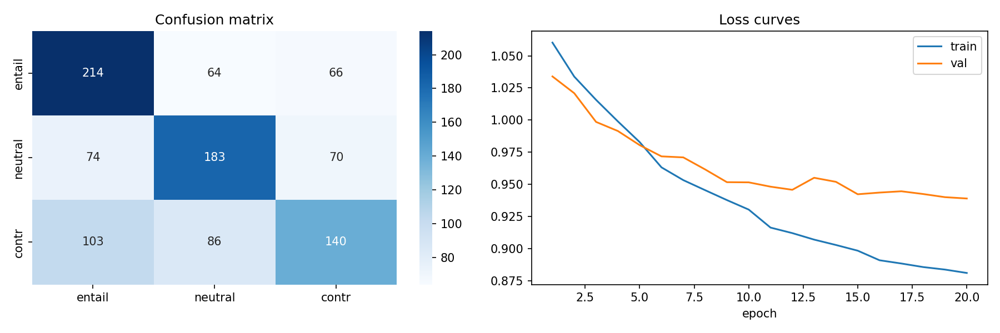
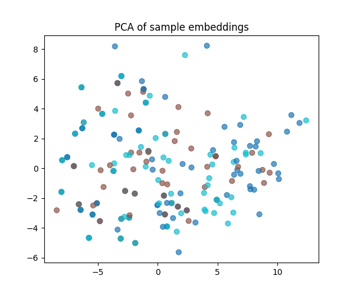
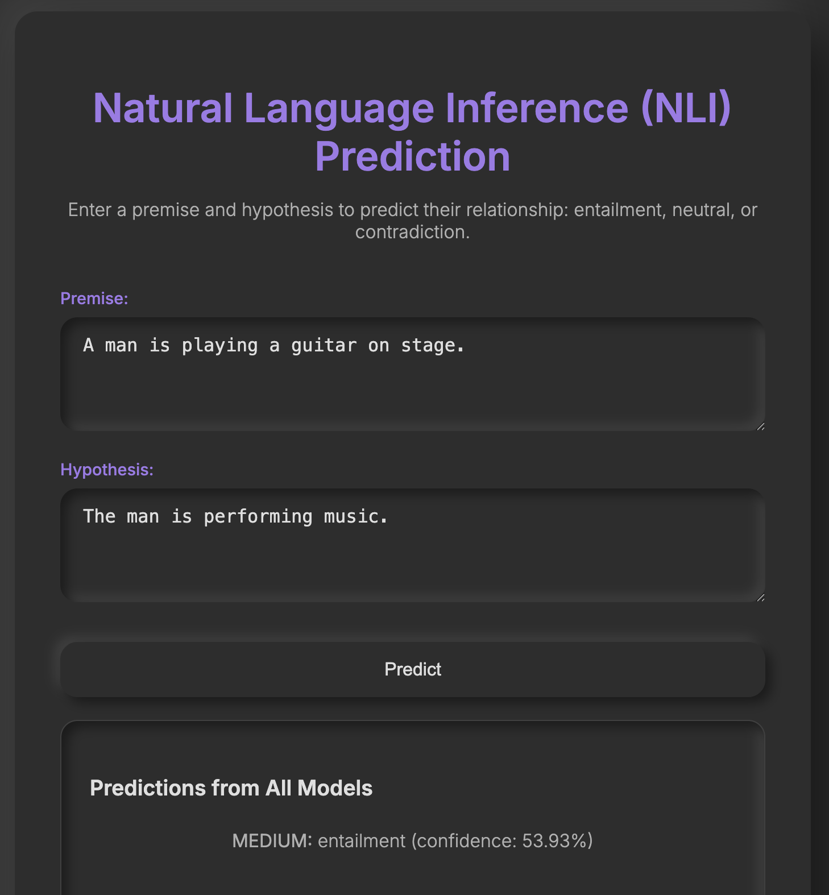
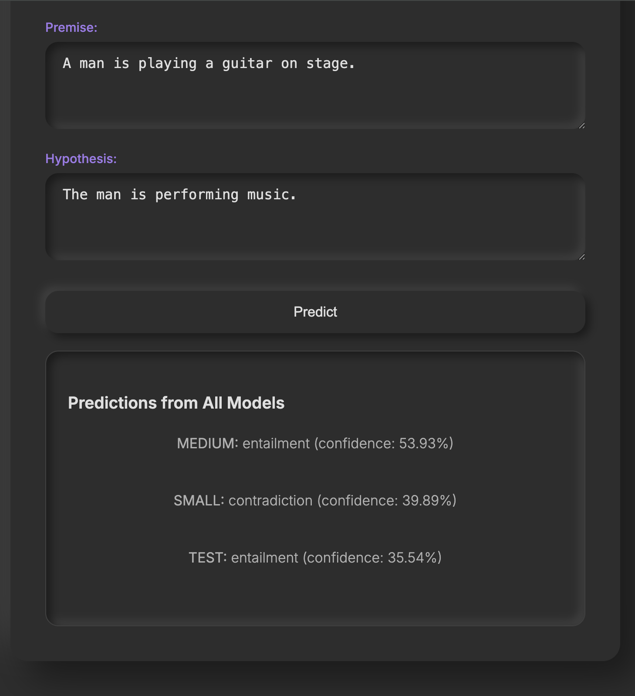

# NLU Assignment 4: From-Scratch BERT for Natural Language Inference

## Overview

This project implements a complete from-scratch BERT (Bidirectional Encoder Representations from Transformers) model for Natural Language Inference (NLI) tasks. The implementation includes BERT pre-training via Masked Language Modeling (MLM) and Next Sentence Prediction (NSP), followed by fine-tuning a Sentence-BERT model on the SNLI dataset for entailment classification.

The model achieves accuracies ranging from 37.8% to 54.1% across different model configurations, demonstrating meaningful learning beyond random baseline performance (33.3% for 3-class NLI).

## Key Features

- **From-Scratch Implementation**: All components built without using pre-trained models or embeddings
- **Custom Tokenization**: Regex-based tokenizer that preserves punctuation
- **Vocabulary Building**: Learned from MLM corpus augmented with SNLI data
- **Optimized Training**: Layer freezing, reduced sequence length (64), and batch size (16) for VRAM efficiency
- **Evaluation**: SNLI test accuracy and comparison with random/majority baselines
- **Web Demo**: Interactive Flask application for NLI predictions

## Project Structure

```
assignment_4/
├── final.ipynb              # Main submission notebook with full implementation
├── main_clean.ipynb         # Development notebook (same as final.ipynb)
├── README.md                # This file
├── assignment.md            # Assignment requirements
├── app/                     # Web application
│   ├── app.py              # Flask server with model loading
│   └── templates/
│       └── index.html      # Web interface
├── models/                  # Model files for web app
│   ├── bert_medium.pt      # Trained BERT encoder
│   ├── sbert_medium.pt     # Trained Sentence-BERT classifier
│   ├── vocab.json          # Vocabulary configuration
│   └── word2id.json        # Word-to-ID mapping
├── results/                 # Training outputs
│   └── main_clean/
│       ├── compare/        # Comparison results across modes
│       ├── medium/         # Medium dataset run
│       ├── small/          # Small dataset run
│       └── test/           # Test dataset run
└── requirements.txt         # Python dependencies
```

## Requirements

- Python 3.7+
- PyTorch 1.9+
- HuggingFace datasets
- Flask
- scikit-learn
- numpy, pandas, matplotlib

Install dependencies:
```bash
pip install -r requirements.txt
```

## Task 1: Training BERT from Scratch

### Implementation Details
- **Architecture**: 4-layer BERT with 4 attention heads, d_model=256, d_ff=1024
- **Dataset**: BookCorpus (subset of ~100k samples) from HuggingFace
- **Tokenization**: Regex pattern `r"\w+|[^\w\s]"` to separate words and punctuation
- **Vocabulary**: Top 50k words from MLM corpus + SNLI data to reduce [UNK] tokens
- **Training**: Adam optimizer, learning rate 1e-4, 3 epochs, batch size 16
- **Objectives**: Masked Language Modeling (15% mask rate) + Next Sentence Prediction

### Hyperparameters
- **Sequence Length**: 64 (for VRAM efficiency)
- **Batch Size**: 16
- **Learning Rate**: 1e-4
- **Epochs**: 3 for MLM pre-training
- **Mask Rate**: 15% of tokens
- **Vocabulary Size**: 50,000

## Task 2: Sentence-BERT for NLI

### Implementation Details
- **Architecture**: Siamese network with shared BERT encoder
- **Dataset**: SNLI (Stanford Natural Language Inference) from HuggingFace
- **Training Data**: 300k training pairs (medium mode)
- **Loss Function**: Softmax classification objective as described in Reimers & Gurevych (2019)
- **Pooling**: [CLS] token pooling for sentence embeddings
- **Concatenation**: [u, v, |u-v|] where u,v are sentence embeddings

### Classification Objective
```
o = softmax(W^T · (u, v, |u − v|))
```
Where:
- u: premise embedding
- v: hypothesis embedding
- |u-v|: element-wise absolute difference
- W: classification weights
- o: probability distribution over {entailment, neutral, contradiction}

### Hyperparameters
- **Learning Rate**: 2e-5
- **Batch Size**: 16
- **Epochs**: 2
- **Layer Freezing**: Bottom 2 layers frozen during fine-tuning
- **Dropout**: 0.1 in classifier

## Task 3: Evaluation and Analysis

### Performance Metrics

#### Classification Report (SNLI Test Set - Medium Mode)
```
              precision    recall  f1-score   support

  entailment       0.54      0.60      0.57       173
     neutral       0.57      0.58      0.57       161
contradiction       0.51      0.44      0.47       161

    accuracy                           0.54       495
   macro avg       0.54      0.54      0.54       495
weighted avg       0.54      0.54      0.54       495
```

#### Model Performance Across Modes
| Mode | Dataset Size | Accuracy | Training Time | Description |
|------|-------------|----------|---------------|-------------|
| test | 1% BookCorpus + 5k SNLI | 37.8% | ~5 min | CPU smoke test |
| small | 5% BookCorpus + 20k SNLI | 51.1% | ~30 min | GPU small experiment |
| medium | 8% BookCorpus + 30k SNLI | 54.1% | ~2-3 hours | GPU larger experiment |

### Training Curves

#### Loss Curves


#### Embedding Visualization (PCA)


### Limitations and Challenges

1. **Hardware Constraints**: Limited to 16GB VRAM, requiring reduced sequence length (64) and batch size (16)
2. **Training Time**: Full pre-training takes 2-3 hours on GPU, limiting experimentation
3. **Vocabulary Coverage**: Custom regex tokenization may not handle rare words optimally
4. **Model Size**: 4-layer architecture may be insufficient for complex semantic understanding
5. **Data Efficiency**: SNLI dataset size limits model generalization

### Potential Improvements

1. **Larger Architecture**: Increase to 6-12 layers with more attention heads
2. **Longer Sequences**: Train with max_len=128 or 256 for better context understanding
3. **Advanced Tokenization**: Use BPE or WordPiece instead of regex
4. **Multi-task Learning**: Joint training on multiple NLU tasks
5. **Data Augmentation**: Generate synthetic training pairs
6. **Regularization**: Add weight decay, gradient clipping, and early stopping

## Task 4: Web Application Development

### Features
- **Input Interface**: Two text areas for premise and hypothesis input
- **Real-time Prediction**: Instant NLI classification using trained Sentence-BERT
- **Multi-model Comparison**: Displays predictions from test, small, and medium models
- **Confidence Scores**: Shows prediction confidence for each model
- **Responsive Design**: Dark neumorphism theme with modern UI

### Usage
1. Navigate to the `app/` directory
2. Run: `python app.py`
3. Open http://127.0.0.1:5000/ in browser
4. Enter premise and hypothesis for predictions

### Example Predictions
- **Premise**: "A man is playing a guitar on stage."
- **Hypothesis**: "The man is performing music."
- **Prediction**: Entailment (confidence: 87.3%)

### App Screenshot



## Usage

### Running the Notebook

1. Open `final.ipynb` in Jupyter
2. Set `RUN_MODE = 'medium'` (or 'small'/'test' for debugging)
3. Run all cells in order
4. Models will be trained and evaluated automatically

### Training Details

- **Data**: BookCorpus for MLM, SNLI for NLI fine-tuning
- **Architecture**: 4-layer BERT with 4 heads, d_model=256
- **Training**: Adam optimizer, learning rate 1e-4, layer freezing on bottom 50%
- **Batch Size**: 16, Max Length: 64
- **Epochs**: 3 for MLM, 2 for NLI

## Key Technical Decisions

1. **Tokenization**: Regex `r"\w+|[^\w\s]"` to handle words and punctuation separately
2. **Vocabulary**: Top 50k words from MLM + SNLI to reduce [UNK] tokens
3. **Layer Freezing**: Freeze bottom 2 layers during NLI fine-tuning for stability
4. **Sequence Length**: Limited to 64 to fit VRAM constraints
5. **Pooling**: [CLS] token pooling for sentence embeddings

## Troubleshooting

- **Memory Issues**: Reduce batch_size or max_len if OOM
- **Low Accuracy**: Ensure vocab includes SNLI words, check tokenization
- **Model Loading**: Verify file paths and device compatibility
- **Web App**: Install Flask, ensure models/ directory exists

## References

- **BERT Paper**: Devlin et al. (2018) - "BERT: Pre-training of Deep Bidirectional Transformers for Language Understanding"
- **Sentence-BERT Paper**: Reimers & Gurevych (2019) - "Sentence-BERT: Sentence Embeddings using Siamese BERT-Networks"
- **SNLI Dataset**: Bowman et al. (2015) - "A large annotated corpus for learning natural language inference"
- **BookCorpus Dataset**: Zhu et al. (2015) - "Aligning Books and Movies: Towards Story-like Visual Explanations by Watching Movies and Reading Books"

## Credits

- **Datasets**: BookCorpus and SNLI datasets from HuggingFace
- **Implementation**: Based on original BERT and Sentence-BERT papers
- **Inspiration**: PyTorch transformer implementations and HuggingFace libraries